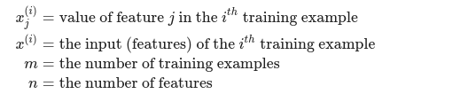
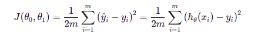

# Linear Regression

Linear regression with multiple variables is also known as "multivariate linear regression".

We now introduce notation for equations where we can have any number of input variables.



This file contains code that helps you get started on the linear exercise. 

In this exercise, you will implement linear regression and get to see it work on data, 
so we need to know two mathematics functions; `cost function` and `Gradient Descent`

### 1. Cost Function :
We can measure the accuracy of our hypothesis function by using a cost function. 
This takes an average difference (actually a fancier version of an average) of all
the results of the hypothesis with inputs from x's and the actual output y's.

<<<<<<< HEAD


This function is otherwise called the `Squared error function`, or `Mean squared error`. 
The mean is halved `(0.5)` as a convenience for the computation of the gradient descent, 
as the derivative term of the square function will cancel out the (0.5) term. The following 
image summarizes what the cost function does: 

### 2. Gradiant Descent :


=======
```
$J(\theta_{0}, \theta_{1}) = \frac{1}{2m}$
```
>>>>>>> 8b94beebc841fe2b0fe1e55724ff31af9d0ba110

